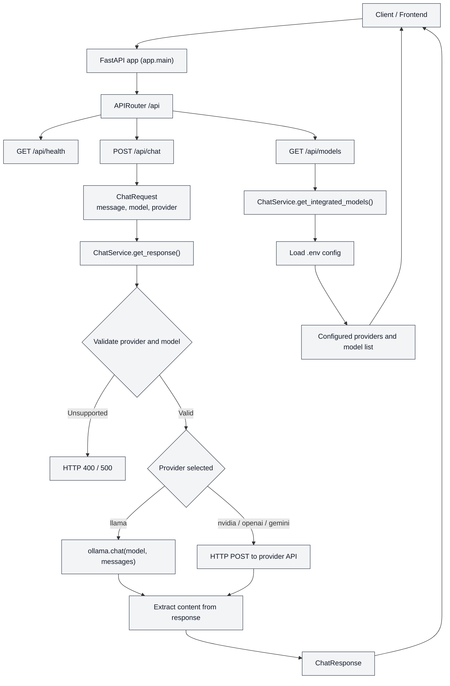

# ChatBot Backend

A FastAPI backend project for chat completions that can route requests to multiple model providers. The application reads provider settings from environment variables, validates the provider and model, and sends the user message to the selected backend before returning the generated response.

## Architecture overview

The application is structured as:

- `app/main.py` - creates the FastAPI app and includes the router
- `app/routers/__init__.py` - defines endpoint handlers
- `app/services.py` - contains the provider selection, validation, payload generation, and response extraction logic
- `app/schemas.py` - defines request/response Pydantic models

## Data flow diagram



## Setup

```bash
python3 -m venv .venv
source .venv/bin/activate
pip install -r requirements.txt
```

## Run

```bash
uvicorn app.main:app --reload --host 0.0.0.0 --port 8000
```

## Environment variables

Add these values to a `.env` file in the project root:

```env
DEFAULT_PROVIDER=nvidia
SUPPORTED_PROVIDERS=nvidia,openai,gemini,llama

NVIDIA_API_KEY=your_nvidia_api_key
NVIDIA_API_URL=your_nvidia_endpoint_url
NVIDIA_MODEL=your_default_nvidia_model
NVIDIA_SUPPORTED_MODELS=model-a,model-b

OPENAI_API_KEY=your_openai_api_key
OPENAI_API_URL=https://api.openai.com/v1/chat/completions
OPENAI_MODEL=gpt-4o-mini
OPENAI_SUPPORTED_MODELS=gpt-4o-mini,gpt-4o

GEMINI_API_KEY=your_gemini_api_key
GEMINI_API_URL=https://generativelanguage.googleapis.com/v1beta/models/{model}:generateContent
GEMINI_MODEL=gemini-1.5-flash
GEMINI_SUPPORTED_MODELS=gemini-1.5-flash,gemini-1.5-pro

LLAMA_MODEL=llama3.1
```

Notes:

- `DEFAULT_PROVIDER` controls which provider is used when `provider` is not provided in the request.
- `SUPPORTED_PROVIDERS` restricts the allowed provider list.
- For local Ollama, the app calls `ollama.chat()` directly and does not require an API key or URL.

## API endpoints

Base URL:

```text
http://127.0.0.1:8000
```

### 1) Root status

```http
GET /
```

Returns:

```json
{
  "message": "ChatBot Backend is running"
}
```

### 2) Health check

```http
GET /api/health
```

Returns:

```json
{
  "status": "ok"
}
```

### 3) List available models

```http
GET /api/models
```

This reads provider/model config values from the environment and responds with a flattened list of models, each including the provider name and the model identifier.

Example response:

```json
[
  {
    "provider": "NVIDIA",
    "model": "meta/llama-3.1-70b-instruct"
  },
  {
    "provider": "Llama",
    "model": "llama3.1"
  }
]
```

### 4) Chat completion

```http
POST /api/chat
```

Request body (`ChatRequest`):

```json
{
  "message": "Hello, how are you?",
  "provider": "nvidia",
  "model": "meta/llama-3.1-70b-instruct"
}
```

Fields:

- `message` (required): user text input
- `provider` (optional): target provider, such as `nvidia`, `openai`, `gemini`, or `llama`
- `model` (optional): provider-specific model override; if omitted, the default configured model is used

Response (`ChatResponse`):

```json
{
  "response": "Hello! How can I help you today?"
}
```

Request validation rules from the service:

- If a provider is not in `SUPPORTED_PROVIDERS`, the request is rejected with HTTP 400.
- If the selected provider is `llama`, the app calls `ollama.chat()` directly.
- For `nvidia`, `openai`, and `gemini`, the app sends an HTTP request to the configured URL with the required auth headers.
- If no content is extracted from the provider response, the app returns HTTP 502.

## Example requests

### Curl example

```bash
curl -X POST http://127.0.0.1:8000/api/chat \
  -H "Content-Type: application/json" \
  -d '{
    "message": "Hello, how are you?",
    "provider": "llama",
    "model": "llama3.1"
  }'
```

### Python example

```python
import requests

payload = {
    "message": "Summarize this project.",
    "provider": "nvidia",
    "model": "meta/llama-3.1-70b-instruct"
}

response = requests.post("http://127.0.0.1:8000/api/chat", json=payload)
print(response.json())
```

## Ollama / Llama 3.1 setup

1. Install the Ollama CLI on Linux:
   ```bash
   curl -fsSL https://ollama.com/install.sh | sh
   exec $SHELL
   ```

2. Verify the CLI is available:
   ```bash
   ollama --version
   ```

3. Start the Ollama server in its own terminal:
   ```bash
   ollama serve
   ```

4. Pull the model in another terminal:
   ```bash
   ollama pull llama3.1
   ```

5. Ensure the `.env` file contains:
   ```env
   DEFAULT_PROVIDER=llama
   LLAMA_MODEL=llama3.1
   ```

6. Start the backend:
   ```bash
   uvicorn app.main:app --reload --host 0.0.0.0 --port 8000
   ```

7. Use the `llama` provider in the request body as shown above.

## Notes for developers

- The router is mounted under `/api`.
- All chat logic is centralized in `ChatService` rather than inside the route handler.
- Response parsing is provider-specific and normalizes the provider output into a single `response` string.
- The app currently supports `nvidia`, `openai`, `gemini`, and `llama` through environment-based configuration.
